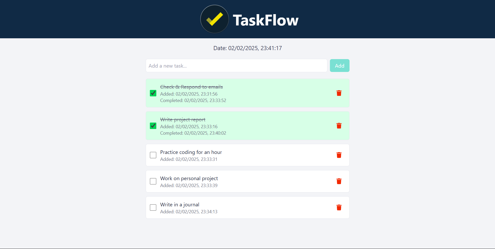

# TaskFlow - To-Do Application

**TaskFlow** is a simple to-do application designed to help users manage their tasks efficiently.

### Key Features:
- **Task Management**: Users can create and delete tasks.
- **Task Completion**: Mark tasks as completed.
- **Responsive Design**: The app is fully responsive and works seamlessly across desktop, tablet, and mobile devices.

### Tech Stack:
- **Frontend**: React + Vite
- **UI Framework**: Tailwind CSS

### Preview

 
